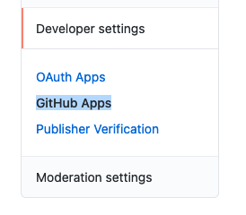
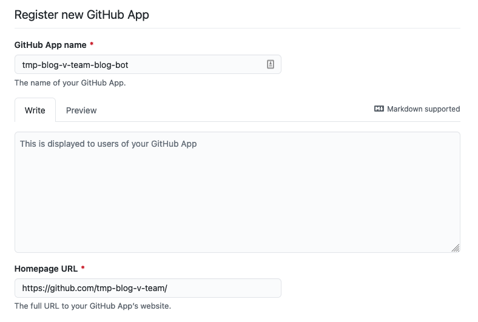
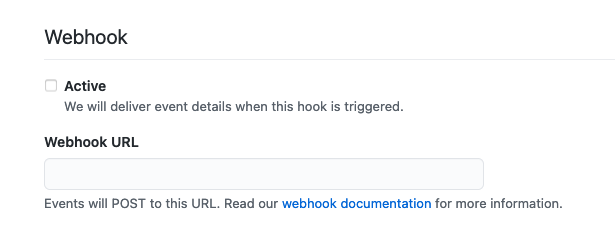
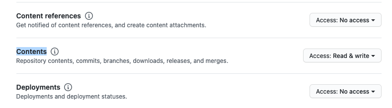
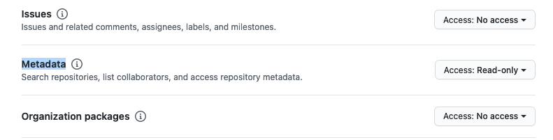
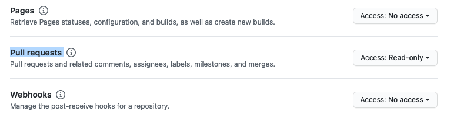
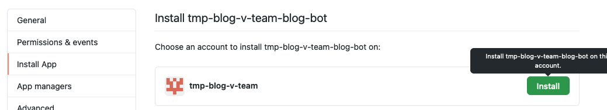
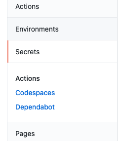

Developer settings > GitHub Apps

[New GitHub App]

Enter [GitHub App name] and [Homepage URL]

Disable Webhook [Active]

Add Repository permissions

* Contents: Read & write
* Metadata: Read-only
* Pull requests: Read-only

Select [Only on this account]
Click [Create GitHub App]

Copy [App ID]

[Generate a private key]

Move to [Install App] section
Click [Install]

Enable [Only select repositories] option and select your blog repository.

Move to your blog repository settings.

Click [New repository secret] and add following secrets:

* APP_ID: App ID of created GitHub App
* PRIVATE_KEY: Private key of created GitHub App
* AZURE_STORAGE_CONNECTION_STRING: Connection string for Azure Blob Storage

